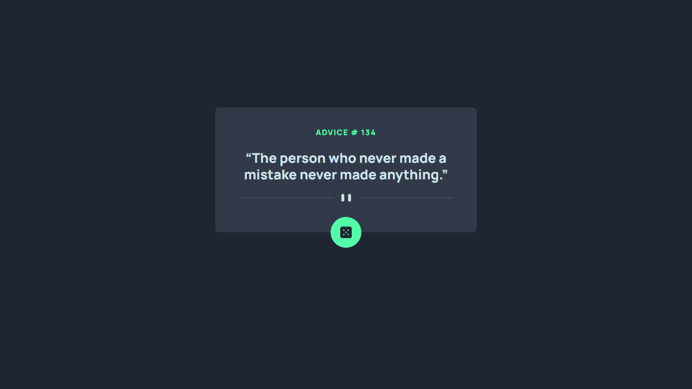

# Frontend Mentor - Advice generator app solution

This is a solution to the [Advice generator app challenge on Frontend Mentor](https://www.frontendmentor.io/challenges/advice-generator-app-QdUG-13db). Frontend Mentor challenges help you improve your coding skills by building realistic projects.

## Table of contents

- [Overview](#overview)
  - [The challenge](#the-challenge)
  - [Screenshot](#screenshot)
  - [Links](#links)
  - [Built with](#built-with)
- [Author](#author)

## Overview

### The challenge

Users should be able to:

- View the optimal layout for the app depending on their device's screen size
- See hover states for all interactive elements on the page
- Generate a new piece of advice by clicking the dice icon

### Screenshot

#### Desktop View

#### Desktop View

### Links

- Solution URL: [https://github.com/sezaru-dev/advice-generator-app](https://github.com/sezaru-dev/advice-generator-app)
- Live Site URL: [https://sezaru-dev-advice-generator-app.netlify.app/](https://sezaru-dev-advice-generator-app.netlify.app/)

### Built with

- HTML5
- CSS
- Desktop-first workflow
- [React](https://reactjs.org/) - JS library
- [Vite.js](https://vitejs.dev/) - JS Development Tool
- [TailwindCSS](https://tailwindcss.com/) - CSS Framework
- [Advice Slip API](https://api.adviceslip.com)

## Author

- Frontend Mentor - [sezaru-dev](https://www.frontendmentor.io/profile/sezaru-dev)

